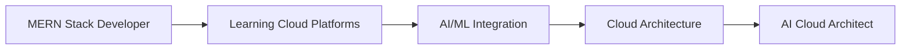

<div align="center">

# 👋 Hey there! I'm Krishan Yadav

### 🚀 Full Stack Developer → AI Cloud Architect | MERN Stack Expert

<picture>
  <source media="(prefers-color-scheme: dark)" srcset="https://raw.githubusercontent.com/KrishanYadav333/KrishanYadav333/output/pacman-contribution-graph-dark.svg">
  <source media="(prefers-color-scheme: light)" srcset="https://raw.githubusercontent.com/KrishanYadav333/KrishanYadav333/output/pacman-contribution-graph.svg">
  
</picture>

---

## 🎯 What I'm Up To

```javascript
class KrishanYadav {
    constructor() {
        this.currentRole = "Full Stack Developer";
        this.expertise = ["MERN Stack", "Next.js", "Nest.js"];
        this.transitioning_to = "AI Cloud Architect";
        this.learning = ["AWS/Azure", "Machine Learning", "Cloud Architecture"];
        this.passion = ["Building scalable apps", "AI integration", "Cloud solutions"];
    }
    
    getDailyRoutine() {
        return ["☕ Coffee", "⚛️ React/Next.js", "🔧 Node.js/Nest.js", "☁️ Cloud Learning", "🔄 Repeat"];
    }
}
```

## 🛠️ Tech Arsenal

### Frontend Mastery


### Backend & APIs


### Databases


### Cloud & AI (Learning Path)


### Tools & Others


## 🎯 My Journey: Full Stack → AI Cloud Architect



**Current Focus:**
- 🔧 Building scalable full-stack applications with MERN + Next.js
- ☁️ Learning AWS/Azure cloud services and architecture patterns  
- 🤖 Integrating AI/ML capabilities into web applications
- 📚 Studying cloud-native development and microservices

## 📊 GitHub Analytics

<div align="center">
  
  
</div>

<div align="center">
  
</div>

## 🏆 Achievement Unlocked

<div align="center">
  
</div>

## 🚀 Featured Projects

*Building awesome full-stack applications with modern tech stacks...*

## 🌐 Let's Connect!

<div align="center">

[](https://linkedin.com/in/krishan-yadav-323425253)
[](https://x.com/KrishanYdv1191)
[](https://instagram.com/harshhh_1191)
[](mailto:kryshan753@gmail.com)

</div>

---

<div align="center">
  
### 💡 "The best way to predict the future is to create it." - Peter Drucker


**⭐ Star my repos if you find them interesting!**

</div>

</div>