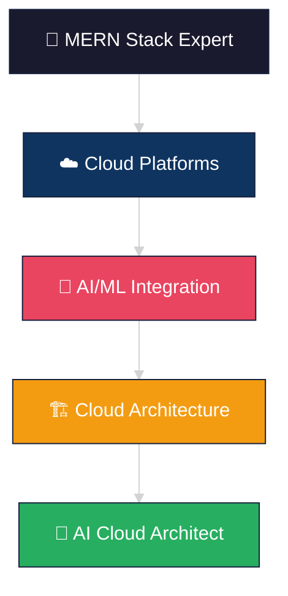

<div align="center">


<div style="background: rgba(255, 255, 255, 0.1); backdrop-filter: blur(10px); border-radius: 20px; border: 1px solid rgba(255, 255, 255, 0.2); padding: 20px; margin: 20px 0;">

### 🚀 MERN Stack Expert | Next.js Specialist | Cloud Enthusiast

</div>

<picture>
  <source media="(prefers-color-scheme: dark)" srcset="https://raw.githubusercontent.com/KrishanYadav333/KrishanYadav333/output/pacman-contribution-graph-dark.svg">
  <source media="(prefers-color-scheme: light)" srcset="https://raw.githubusercontent.com/KrishanYadav333/KrishanYadav333/output/pacman-contribution-graph.svg">
  
</picture>

---


##  **About Me**

```javascript
const krishan = {
    currentRole: "Full Stack Developer",
    expertise: ["MERN Stack", "Next.js", "Nest.js", "TypeScript"],
    transitioning_to: "AI Cloud Architect",
    learning: ["AWS", "Azure", "Machine Learning", "Microservices"],
    passion: ["Scalable Architecture", "AI Integration", "Cloud Solutions"],
    
    getDailyStack() {
        return [
            "☕ Coffee + Dark Theme",
            "⚛️ React/Next.js Magic", 
            "🔧 Node.js/Nest.js APIs",
            "☁️ Cloud Architecture",
            "🌙 Glassmorphism UI"
        ];
    }
};
```


##  **Tech Arsenal**

<table>
<tr>
<td width="50%">

### 🎨 **Frontend Mastery**


### 🔧 **Backend Power**


</td>
<td width="50%">

### 🗄️ **Database & Storage**


### ☁️ **Cloud & AI Journey**


</td>
</tr>
</table>


##  **Evolution Path**

<div align="center">



</div>

**🎯 Current Mission:**
- 🔥 Building scalable full-stack applications with modern MERN stack
- ☁️ Mastering AWS/Azure cloud services & serverless architecture
- 🤖 Integrating AI/ML capabilities into production applications
- 🏗️ Learning microservices, containers, and cloud-native patterns


##  **GitHub Analytics**

<div align="center">
<table>
<tr>
<td width="50%">


</td>
<td width="50%">


</td>
</tr>
</table>
</div>

<div align="center">

</div>


##  **Connect With Me**

<div align="center">

[](https://linkedin.com/in/krishan-yadav-323425253)
[](https://x.com/KrishanYdv1191)
[](https://instagram.com/harshhh_1191)
[](mailto:kryshan753@gmail.com)

</div>


<div align="center">

###  **"Code is poetry written in logic"**


**✨ Building the future, one commit at a time ✨**

</div>


</div>